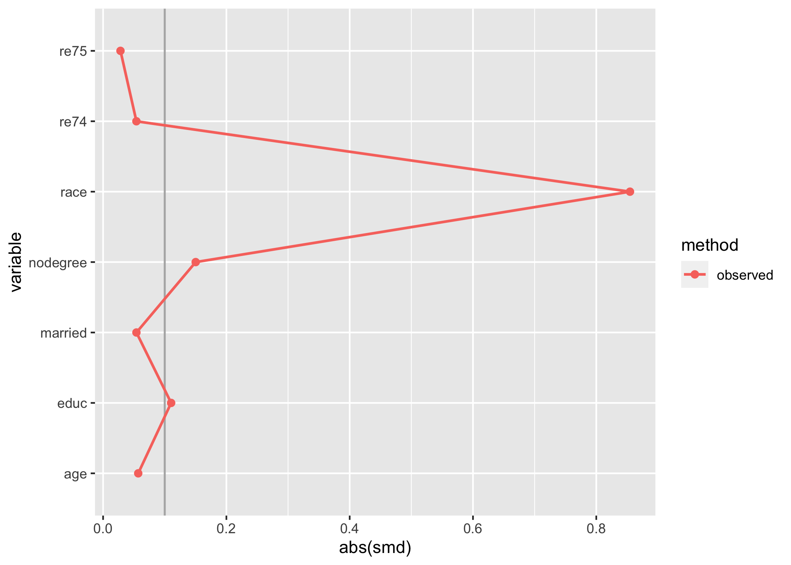
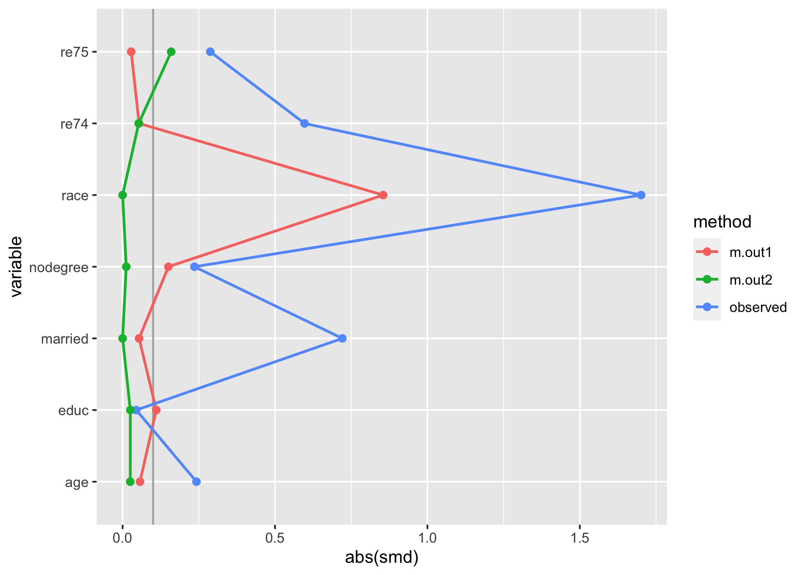

<!-- README.md is generated from README.Rmd. Please edit that file -->

# tidysmd

<!-- badges: start -->

[](https://github.com/r-causal/tidysmd/actions/workflows/R-CMD-check.yaml)
[](https://app.codecov.io/gh/malcolmbarrett/tidysmd?branch=main)
[](https://CRAN.R-project.org/package=tidysmd)
<!-- badges: end -->

**Note: tidysmd has been subsumed under the [halfmoon
package](https://r-causal.github.io/halfmoon/); all the functions in
this package are re-exported in halfmoon. While tidysmd will remain on
CRAN, we recommend using the halfmoon package instead**

The goal of tidysmd is to easily create tidy data frames of SMDs.
tidysmd wraps the smd package to easily calculate SMDs across many
variables and using several weights in order to easily compare different
adjustment strategies.

## Installation

You can install the most recent version of tidysmd from CRAN with:

``` r
install.packages("tidysmd")
```

Alternatively, you can install the development version of tidysmd from
[GitHub](https://github.com/) with:

``` r
# install.packages("devtools")
devtools::install_github("malcolmbarrett/tidysmd")
```

## Example: Weighting

`tidy_smd()` supports both unweighted SMDs and weighted SMDs.

``` r
library(tidysmd)
tidy_smd(nhefs_weights, c(age, education, race), .group = qsmk)
#> # A tibble: 3 × 4
#>   variable  method   qsmk     smd
#>   <chr>     <chr>    <chr>  <dbl>
#> 1 age       observed 1     -0.282
#> 2 education observed 1      0.196
#> 3 race      observed 1      0.177
```

`nhefs_weights` contains several types of propensity score weights for
which we can calculate SMDs. Unweighted SMDs are also included by
default.

``` r
tidy_smd(
  nhefs_weights,
  c(age, race, education),
  .group = qsmk,
  .wts = c(w_ate, w_att, w_atm)
)
#> # A tibble: 12 × 4
#>    variable  method   qsmk       smd
#>    <chr>     <chr>    <chr>    <dbl>
#>  1 age       observed 1     -0.282  
#>  2 race      observed 1      0.177  
#>  3 education observed 1      0.196  
#>  4 age       w_ate    1     -0.00585
#>  5 race      w_ate    1      0.00664
#>  6 education w_ate    1      0.0347 
#>  7 age       w_att    1     -0.0120 
#>  8 race      w_att    1      0.00365
#>  9 education w_att    1      0.0267 
#> 10 age       w_atm    1     -0.00184
#> 11 race      w_atm    1      0.00113
#> 12 education w_atm    1      0.00934
```

Having SMDs in a tidy format makes it easy to work with the estimates,
for instance in creating Love plots. tidysmd includes `geom_love()` to
make this a bit easier:

``` r
library(ggplot2)
plot_df <- tidy_smd(
  nhefs_weights,
  race:active,
  .group = qsmk,
  .wts = starts_with("w_")
)

ggplot(
  plot_df,
  aes(
    x = abs(smd),
    y = variable,
    group = method,
    color = method,
    fill = method
  )
) +
  geom_love()
```


You can also use the quick-plotting function `love_plot()`, if you
prefer:

``` r
love_plot(plot_df) + 
  theme_minimal(14) + 
  ylab(NULL)
```


## Example: Matching

tidysmd also has support for working with matched datasets. Consider
these two objects from the
[MatchIt](https://github.com/kosukeimai/MatchIt) documentation:

``` r
library(MatchIt)
# Default: 1:1 NN PS matching w/o replacement
m.out1 <- matchit(treat ~ age + educ + race + nodegree +
                   married + re74 + re75, data = lalonde)

# 1:1 NN Mahalanobis distance matching w/ replacement and
# exact matching on married and race
m.out2 <- matchit(treat ~ age + educ + race + nodegree +
                   married + re74 + re75, data = lalonde,
                   distance = "mahalanobis", replace = TRUE,
                  exact = ~ married + race)
```

One option is to just look at the matched dataset with tidysmd:

``` r
matched_data <- get_matches(m.out1)

match_smd <- tidy_smd(
  matched_data,
  c(age, educ, race, nodegree, married, re74, re75), 
  .group = treat
)

love_plot(match_smd)
```



The downside here is that you can’t compare multiple matching strategies
to the observed dataset; the label on the plot is also wrong. tidysmd
comes with a helper function, `bind_matches()`, that creates a dataset
more appropriate for this task:

``` r
matches <- bind_matches(lalonde, m.out1, m.out2)
head(matches)
#>      treat age educ   race married nodegree re74 re75       re78 m.out1 m.out2
#> NSW1     1  37   11  black       1        1    0    0  9930.0460      1      1
#> NSW2     1  22    9 hispan       0        1    0    0  3595.8940      1      1
#> NSW3     1  30   12  black       0        0    0    0 24909.4500      1      1
#> NSW4     1  27   11  black       0        1    0    0  7506.1460      1      1
#> NSW5     1  33    8  black       0        1    0    0   289.7899      1      1
#> NSW6     1  22    9  black       0        1    0    0  4056.4940      1      1
```

`matches` includes an binary variable for each `matchit` object which
indicates if the row was included in the match or not. Since
downweighting to 0 is equivalent to filtering the datasets to the
matches, we can more easily compare multiple matched datasets with
`.wts`:

``` r
many_matched_smds <- tidy_smd(
  matches,
  c(age, educ, race, nodegree, married, re74, re75), 
  .group = treat, 
  .wts = c(m.out1, m.out2)
) 

love_plot(many_matched_smds)
```


