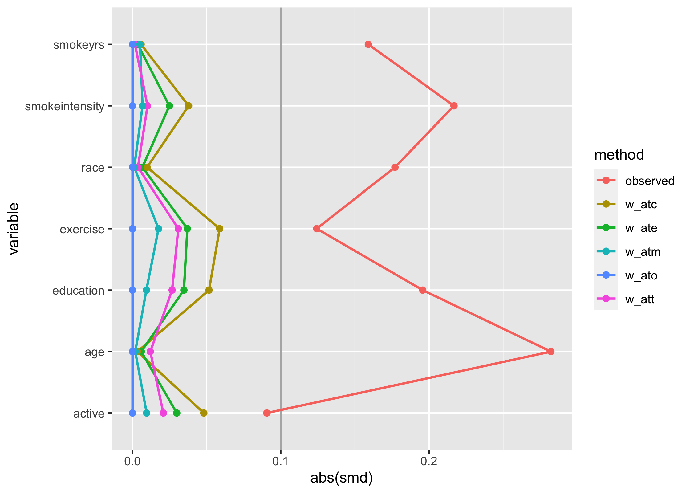
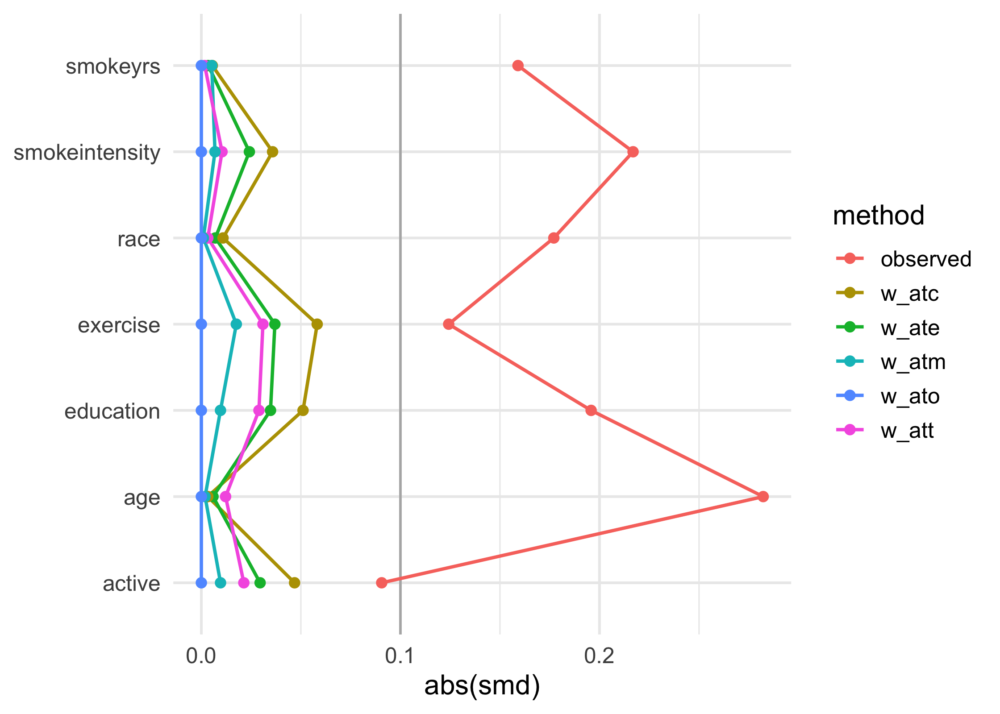

<!-- README.md is generated from README.Rmd. Please edit that file -->

# tidysmd

<!-- badges: start -->

[](https://github.com/malcolmbarrett/tidysmd/actions)
[](https://app.codecov.io/gh/malcolmbarrett/tidysmd?branch=main)
[](https://CRAN.R-project.org/package=tidysmd)
<!-- badges: end -->

The goal of tidysmd is to easily create tidy data frames of SMDs.
tidysmd wraps the smd package to easily calculate SMDs across many
variables and using several weights in order to easily compare different
adjustment strategies.

## Installation

You can install the most recent version of tidysmd from CRAN with:

``` r
install.packages("tidysmd")
```

Alternatively, you can install the development version of tidysmd from
[GitHub](https://github.com/) with:

``` r
# install.packages("devtools")
devtools::install_github("malcolmbarrett/tidysmd")
```

## Example

`tidy_smd()` supports both unweighted SMDs and weighted SMDs.

``` r
library(tidysmd)
tidy_smd(nhefs_weights, c(age, education, race), .group = qsmk)
#> # A tibble: 3 × 4
#>   variable  weights    qsmk     smd
#>   <chr>     <chr>      <chr>  <dbl>
#> 1 age       unweighted 1     -0.282
#> 2 education unweighted 1      0.196
#> 3 race      unweighted 1      0.177
```

`nhefs_weights` contains several types of propensity score weights for
which we can calculate SMDs. Unweighted SMDs are also included by
default.

``` r
tidy_smd(
  nhefs_weights,
  c(age, race, education),
  .group = qsmk,
  .wts = c(w_ate, w_att, w_atm)
)
#> # A tibble: 12 × 4
#>    variable  weights    qsmk       smd
#>    <chr>     <chr>      <chr>    <dbl>
#>  1 age       unweighted 1     -0.282  
#>  2 race      unweighted 1      0.177  
#>  3 education unweighted 1      0.196  
#>  4 age       w_ate      1     -0.00585
#>  5 race      w_ate      1      0.00664
#>  6 education w_ate      1      0.0347 
#>  7 age       w_att      1     -0.0120 
#>  8 race      w_att      1      0.00365
#>  9 education w_att      1      0.0267 
#> 10 age       w_atm      1     -0.00184
#> 11 race      w_atm      1      0.00113
#> 12 education w_atm      1      0.00934
```

Having SMDs in a tidy format makes it easy to work with the estimates,
for instance in creating Love plots. tidysmd includes `geom_love()` to
make this a bit easier:

``` r
library(ggplot2)
plot_df <- tidy_smd(
  nhefs_weights,
  race:active,
  .group = qsmk,
  .wts = starts_with("w_")
)

ggplot(
    plot_df,
    aes(
        x = abs(smd),
        y = variable,
        group = weights,
        color = weights,
        fill = weights
    )
) +
    geom_love()
```



You can also use the quick-plotting function `love_plot()`, if you
prefer:

``` r
love_plot(plot_df) + 
  theme_minimal(14) + 
  ylab(NULL)
```


